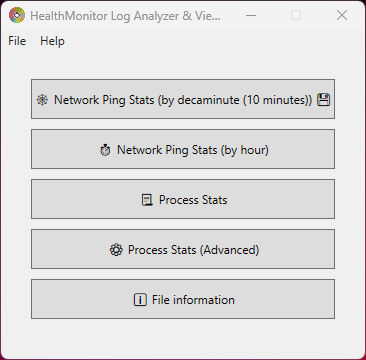
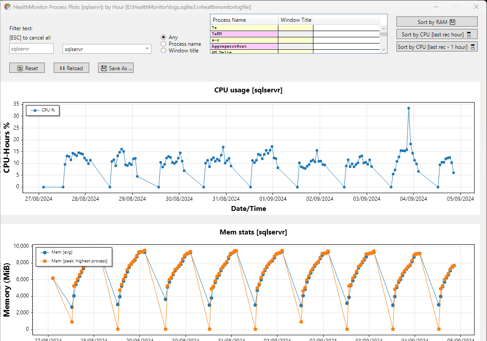
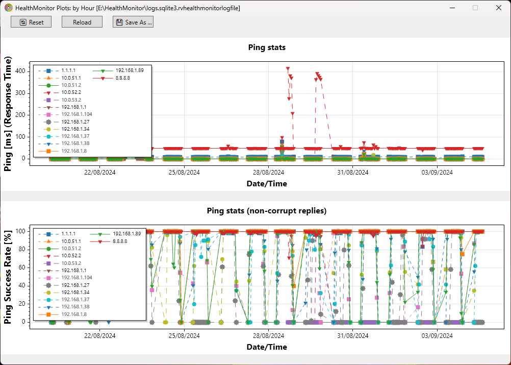
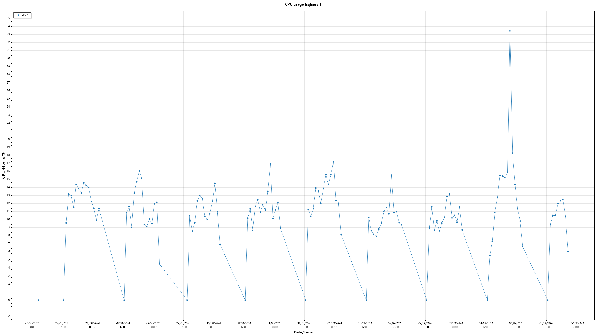
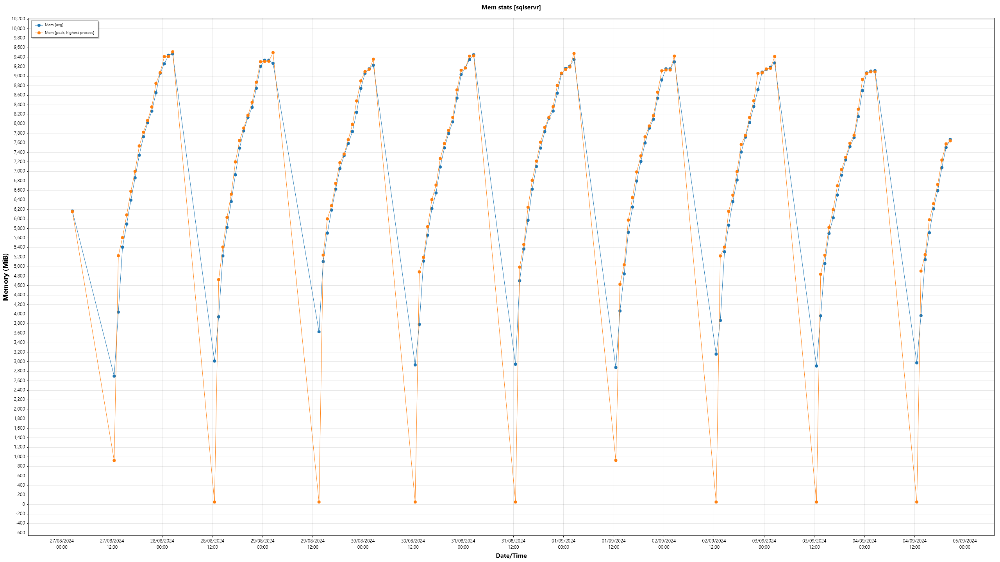
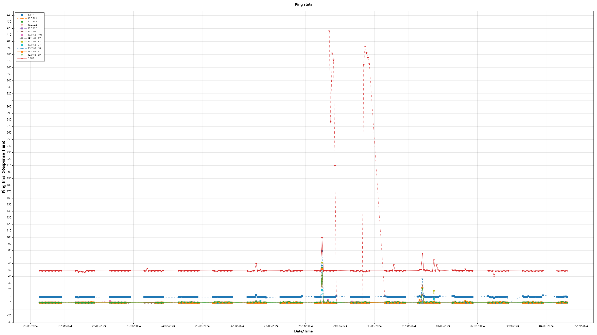
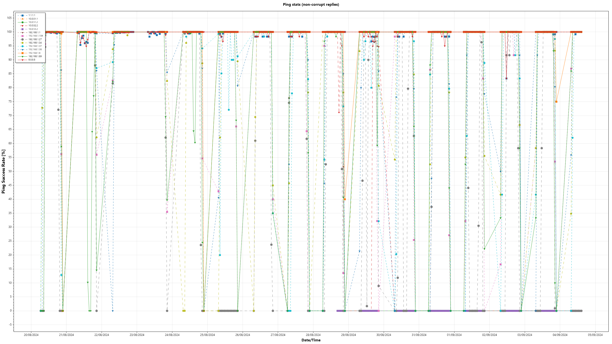

## What's this?
This is a log viewer for log files generated by HealthMonitor. 
HealthMonitor is a system monitoring tool for monitoring the CPU usage and network connectivity.
HealthMonitor and Health Monitor Log Viewer are supposed to be cross-platform but have never been tested outside Microsoft Windows (R).
This project is licensed under OSLv3 (no later). 
This uses Eto.Forms and ScottPlot 5 to present the plots. 
`assoc.ps1` creates a control panel item, performs shell associations and creates a `(Right click menu) -> New -> Health Monitor Log File` when run as an admin or a standard user.
It should be run from the same working directory like:
```pwsh
powershell -ExecutionPolicy Bypass .\assoc.ps1
```

### Screenshots

</img>

Process stats:


</img>

Ping stats:

</img>

#### Exported images (are high-res)

Process stats:

</img>

</img>

Ping stats:

</img>

</img>